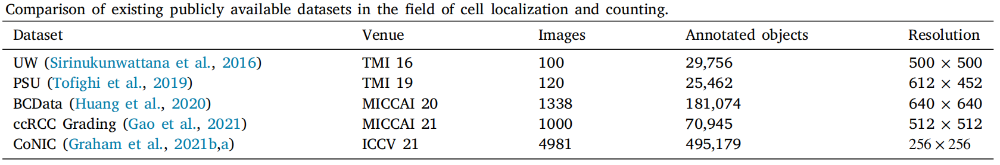

# Cell Localization and Counting

This repository includes three papers about cell:
1) Exponential Distance Transform Maps for Cell Localization; [Paper](https://www.sciencedirect.com/science/article/abs/pii/S0952197624001064?via%3Dihub)
2) Multi-scale Hypergraph-based Feature Alignment Network for Cell Localization;  [Paper](https://www.sciencedirect.com/science/article/pii/S0031320324000116)
3) Lite-UNet: A lightweight and efficient network for cell localization. [Paper](https://www.sciencedirect.com/science/article/pii/S0952197623018183#fig2)


## Overview


# Visualizations


# Datasets

- Download all dataset from [Google-Drive](https://drive.google.com/drive/folders/1jlt9UtApF1GM28PjVwA933kfgbNSZD01?usp=drive_link)



## Installation

Download MHFAN:
```
git clone https://github.com/Boli-trainee/MHFAN
```

# Environment
	python >=3.6 
	pytorch >=1.4
	opencv-python >=4.0
	scipy >=1.4.0
	h5py >=2.10
	pillow >=7.0.0
	imageio >=1.18
	nni >=2.0 (python3 -m pip install --upgrade nni)
 	and so on

# Generate EDT Map (Ground Truth)

```
cd data
python CoNIC_process.py
```
Generate all datasets by this way.

```
Generate image file list: python make_npydata.py
```

# Training

```
python train.py --dataset BCData
```

## Thanks
This code is based on FIDTM (https://github.com/dk-liang/FIDTM). Many thanks for your code implementation.


# Reference
If you find this project is useful for your research, please cite:
```
@article{liang2022focal,
  title={Focal inverse distance transform maps for crowd localization},
  author={Liang, Dingkang and Xu, Wei and Zhu, Yingying and Zhou, Yu},
  journal={IEEE Transactions on Multimedia},
  year={2022},
  publisher={IEEE}
}

@article{li2024multi,
  title={Multi-scale hypergraph-based feature alignment network for cell localization},
  author={Li, Bo and Yong, Zhang and Zhang, Chengyang and Piao, Xinglin and Hu, Yongli and Yin, Baocai},
  journal={Pattern Recognition},
  pages={110260},
  year={2024},
  publisher={Elsevier}
}

```


